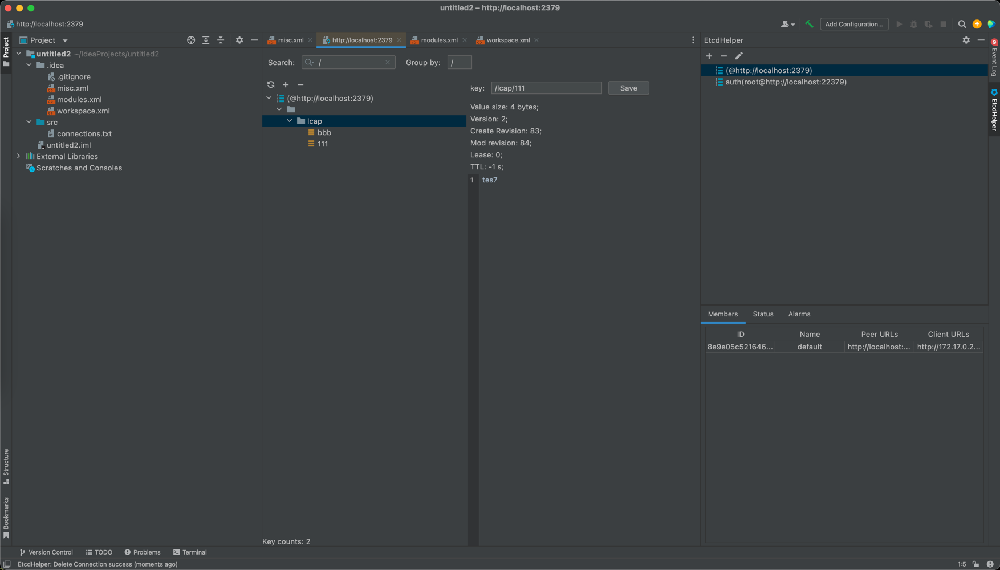
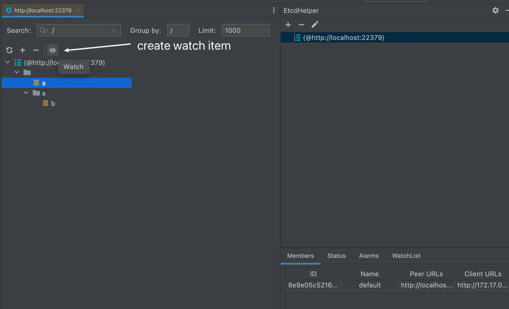
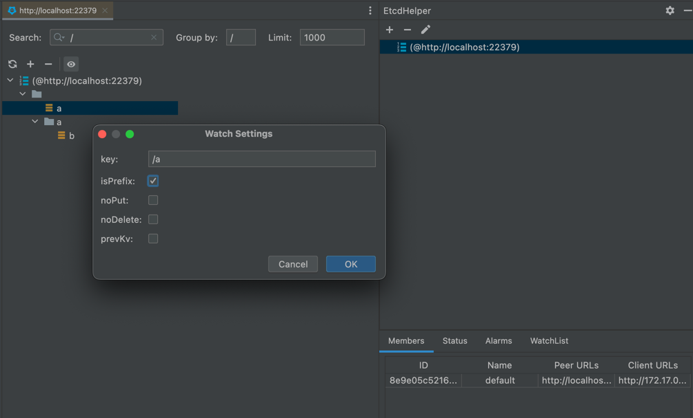
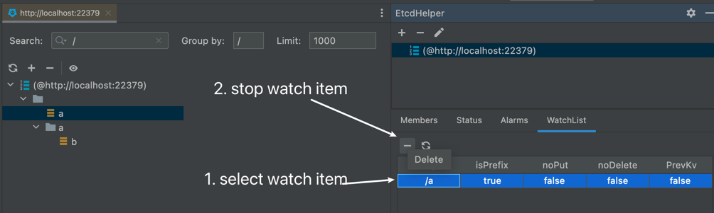

# intellij-etcdhelper

a simple intellij platform etcd plugin

# Table of Content

- [ScreenShots](#screenshots)
    - [Tool Window](#tool-window)
    - [Settings](#settings)
    - [Watch](#watch)
        - [Create](#create-watch-item)
        - [Settings](#fill-up-the-settings-dialog)
        - [Query](#fill-up-the-settings-dialog)
        - [Delete](#stop-watch)
        - [Notification](#get-notification-when-event-triggered)
- [Acknowledgements](#acknowledgements)

## Screenshots

### Tool Window

### Settings

### Watch

#### create watch item

#### fill up the settings dialog

#### query watched items

#### stop watch

#### get notification when event triggered

# Acknowledgements

* JetBrains kindly provides intellij-etcdhelper with a free open-source licence

